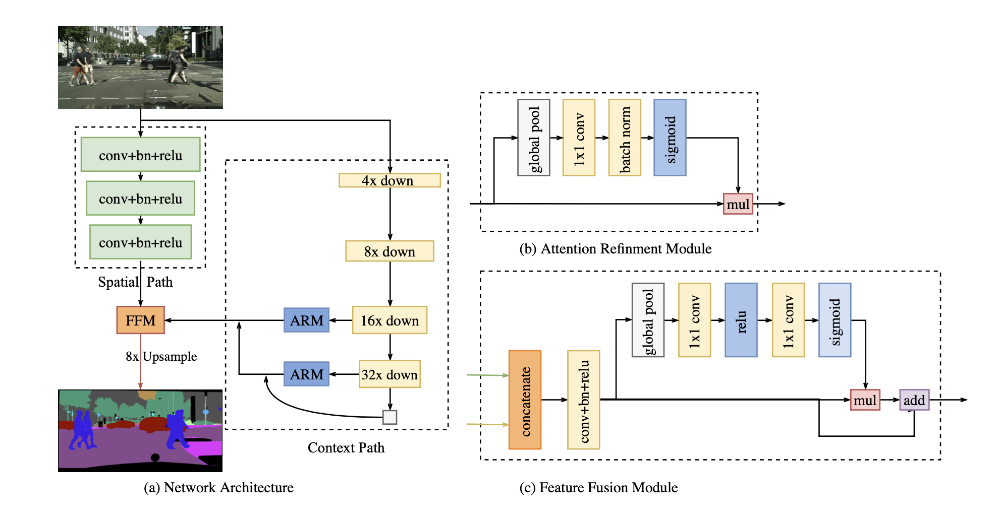

# Virtual Background

|  | 
|:--:| 
| *[BiSeNet](https://arxiv.org/abs/1808.00897)* |>

In online meetings, people frequently avoid to show their backgrounds due to privacy. The virtual background is widely used in many applications such as Zoom conference.

# Project Goals

1. Read a research paper and apply to a **real-world project**
2. Implement [BiSeNet](https://arxiv.org/abs/1808.00897) with PyTorch **from sratch**
3. Implement **end-to-end project pipeline** from scratch with minimum references
4. **Live webcam demo** using OpenCV
5. **Effective project management** using various Git features including issues, pull requests, and version control

# Dataset

- [Kaggle - AISegment](https://www.kaggle.com/datasets/laurentmih/aisegmentcom-matting-human-datasets)
- Download dataset using Kaggle API: `kaggle datasets download -d laurentmih/aisegmentcom-matting-human-datasets`
- `34,427` images(RGB) and corresponding matting(RGBA) results
- Most images are upper-body person images which are suitable for virtual background task.

# Model - BiSeNet

|  | 
|:--:| 
| *[BiSeNet](https://arxiv.org/abs/1808.00897)* |>

The semantic segmentation model selected for this project is [BiSeNet](https://arxiv.org/abs/1808.00897). I was looking for a **real-time** semantic segmentation model with fast speed and decent performance. I assumed that segmentation task for virtual background consisting of two classes (person and background) is a easier task than the cityscapes dataset which the model was tested on. **BiSeNet** achieved `74.7% mIoU` on the **CityScapes test** dataset with `65.5 FPS` and `15.2 ms`. I referenced [paperswithcode](https://paperswithcode.com/sota/real-time-semantic-segmentation-on-cityscapes) and [awesome-semantic-segmentation](https://github.com/mrgloom/awesome-semantic-segmentation) to search models.

BiSeNet effectively secures **sizeable receptive field** and **rich spatial information** using the Spatial Path and Context Path. If you want to look at the **detailed explanation of the paper and the implementation**, check out my **blog** and **deep-learning-papers repo** [BiSeNet Guide & Implementation](https://noisrucer.github.io/paper/bisenet/) or [BiSeNet Repo](https://github.com/noisrucer/deep-learning-papers/tree/master/BiSeNet)

# Training

1. Clone the repo

```bash
git clone https://github.com/noisrucer/virtual-background.git
```

2. Inside the directory, create `data/` and `model_weights/` folders.

3. Download the dataset() and unzip in `data/` folder.

```bash
kaggle datasets download -d laurentmih/aisegmentcom-matting-human-datasets
```

4. Execute `generate_csv.py` in the project directory. Then, `dataset.csv` will be created in `data/`

```bash
python generate_csv.py
```

5. Change the 
5. 

